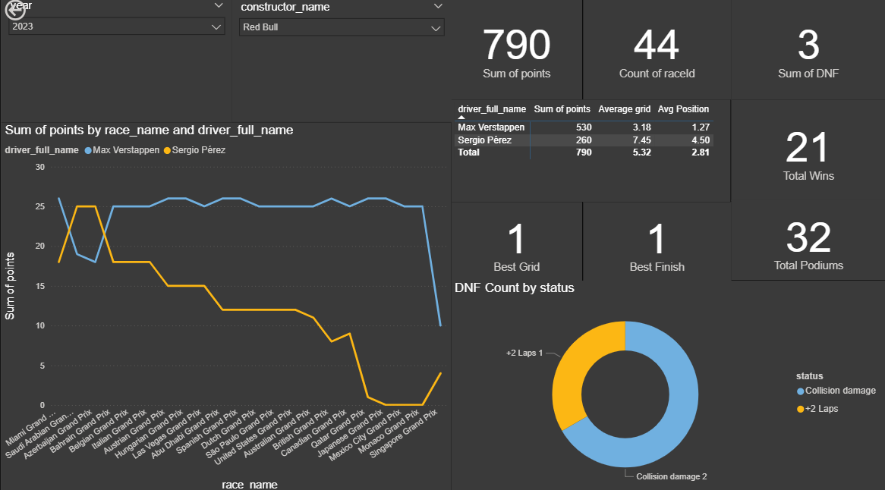
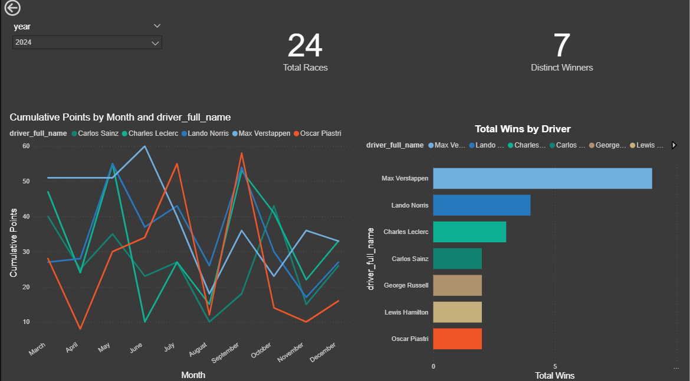

# Formula 1 Performance Dashboard

An interactive **Power BI dashboard** built to analyze Formula 1 race performance across multiple seasons. The dashboard provides insights into driver performance, constructor dominance, race statistics, points progression, podium finishes, and DNF analysis through interactive visualizations.

---

## Project Overview

This dashboard enables users to explore Formula 1 race statistics using interactive filters and visual analytics. It helps identify top-performing drivers and constructors while analyzing race trends, season performance, and championship statistics.

---

## Dashboard Pages

### Page 1 – Constructor Performance Analysis

This page focuses on constructor-level performance for a selected season.

**KPIs**
- Total Points
- Total Races
- Total Wins
- Total Podiums
- Best Grid Position
- Best Finish
- DNF Count

**Visualizations**
- Driver-wise Points by Race
- Constructor Driver Statistics
- Sales-style KPI Cards
- DNF Status Distribution
- Country-wise Race Distribution

---

### Page 2 – Driver Performance Analysis

This page provides season-wise driver performance analysis.

**KPIs**
- Total Races
- Distinct Race Winners

**Visualizations**
- Monthly Cumulative Points Trend
- Driver-wise Total Wins
- Interactive Season Filter

---

## Features

- Interactive slicers
- Season-wise analysis
- Constructor comparison
- Driver performance analysis
- Race statistics
- DNF analysis
- Cumulative points tracking
- Dynamic KPI cards
- Interactive visualizations

---

## Technologies Used

- Power BI
- Power Query
- DAX

---

## Project Structure

```
F1_DASHBOARD
│
├── PowerBI
│   └── DVP_Project_dashboard.pbix
│
├── photos
│   ├── Page1.png
│   └── Page2.png
│
├── .gitignore
└── README.md
```

---

## DAX Measures

Some of the key measures created include:

- Total Points
- Total Races
- Total Wins
- Total Podiums
- Best Grid Position
- Best Finish
- DNF Count
- Distinct Winners
- Average Grid Position
- Average Race Position
- Cumulative Points

---

## Dashboard Preview

### Constructor Performance Dashboard



---

### Driver Performance Dashboard



---

## Key Insights

The dashboard enables users to:

- Compare constructor performance across seasons.
- Analyze driver consistency throughout the championship.
- Track cumulative points progression.
- Identify drivers with the highest number of wins and podiums.
- Evaluate qualifying and finishing performance.
- Monitor DNF trends and race reliability.
- Explore race statistics using interactive filters.

---

## Future Improvements

- Driver comparison dashboard
- Circuit performance analysis
- Pit stop strategy analysis
- Qualifying vs Race Performance
- Championship prediction using historical data
- Team performance trends across multiple seasons

---

## Author

**Samarth Patel**

GitHub: https://github.com/sampatel23